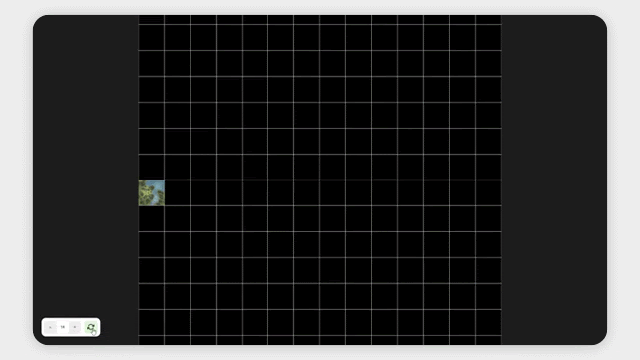

# Wave Function Collapse

A tile-based **Wave Function Collapse (WFC)** implementation for procedural map generation.

<p align="center">
  
</p>

**[Live Demo →](https://xylight0.github.io/wave-function-collapse-map/)**

## Features

- 🧩 Tile-based procedural generation
- 🔗 Constraint propagation
- ⚙️ Configurable tilesets and output size
- 🌍 Procedural map generation
- 🎨 Real-time visualization

## Input Data

The algorithm uses a dataset of **57 images**, available in different resolutions depending on the dataset version:

- `100 × 100`
- `3200 × 3200`

## Getting Started

```bash
git clone https://github.com/Xylight0/wave-function-collapse-map.git
cd big_forest_tiles
